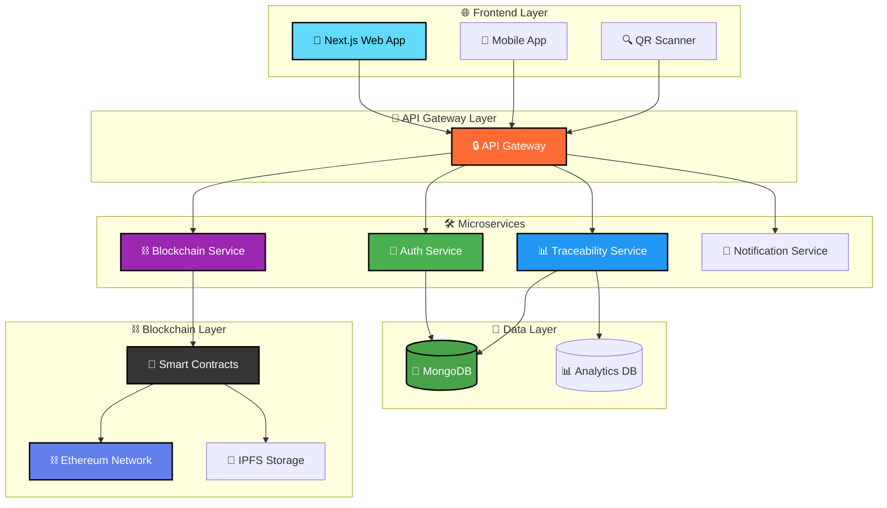

# 🥗 FoodTrace - Food Traceability System

<div align="center">
  
</div>

<div align="center">
  
</div>

---

<div align="center">

## 🎯 **NEXT-GENERATION TECH STACK**


</div>

<p align="center">
  
</p>

<div align="center">
  
  
  
  
</div>

<div align="center">
  
  
  
  
</div>

---

<div align="center">
  
</div>

## 🌟 **ABOUT FOODTRACE**

<div align="center">
  
</div>

<table align="center" width="100%">
<tr>
<td width="50%" align="center">
  
</td>
<td width="50%">

**FoodTrace** revolutionizes food supply chain transparency through cutting-edge blockchain technology. Our platform ensures **food safety**, **authenticity**, and **complete traceability** from farm to fork.

### 🎯 **Why Choose FoodTrace?**
- 🔐 **Immutable blockchain records** guarantee data integrity
- 📱 **Real-time tracking** with QR code integration  
- 🌐 **Web3 enabled** with smart contract automation
- 📊 **Advanced analytics** for supply chain optimization
- 🔍 **Instant verification** for consumers and businesses

</td>
</tr>
</table>

---

<div align="center">
  
</div>

## ✨ **REVOLUTIONARY FEATURES**

<div align="center">
  
</div>

<table align="center" width="100%">
<tr>
<td width="33%" align="center">

### 🔍 **REAL-TIME TRACEABILITY**


- ⚡ Track products through entire supply chain
- 📍 Live location and status updates  
- 🔄 Instant access to product history
- 📈 Real-time quality monitoring

</td>
<td width="33%" align="center">

### 🔐 **BLOCKCHAIN SECURITY**


- 🛡️ Immutable transaction records
- 🤖 Smart contract automation
- 🌐 Decentralized data storage
- 🔒 Cryptographic verification

</td>
<td width="33%" align="center">

### 📱 **QR CODE INTEGRATION**


- 📷 Mobile-friendly scanning
- ⚡ Quick product information access
- ✅ Instant verification system
- 🔗 Direct blockchain connection

</td>
</tr>
</table>

<div align="center">
  
</div>

<table align="center" width="100%">
<tr>
<td width="33%" align="center">

### 📊 **ADVANCED ANALYTICS**


- 📈 Comprehensive dashboards
- 📋 Real-time reporting system
- 🎯 Supply chain insights
- 📉 Performance optimization

</td>
<td width="33%" align="center">

### 🌐 **WEB3 INTEGRATION**


- 💰 Secure cryptocurrency transactions
- 🦊 Wallet connectivity (MetaMask)
- 🔗 DeFi protocol support
- ⛓️ Multi-chain compatibility

</td>
<td width="33%" align="center">

### 📱 **RESPONSIVE DESIGN**


- 📱 Cross-platform compatibility
- 🎨 Modern UI/UX design
- 📲 Progressive Web App features
- 🌙 Dark/Light mode support

</td>
</tr>
</table>

---

<div align="center">
  
</div>

## 🏗️ **SYSTEM ARCHITECTURE**

<div align="center">
  
</div>



<div align="center">
  
  
  
</div>

---

<div align="center">
  
</div>

## 🛠️ **TECHNOLOGY POWERHOUSE**

<div align="center">
  
</div>

### 🎨 **Frontend Excellence**

<div align="center">
  <table>
    <tr>
      <td align="center" width="20%">
        
        <br><strong>Next.js 14</strong>
        <br><sub>⚡ SSR & Performance</sub>
        <br><sub>🔥 App Router</sub>
      </td>
      <td align="center" width="20%">
        
        <br><strong>React 18</strong>
        <br><sub>🪝 Modern Hooks</sub>
        <br><sub>⚛️ Concurrent Features</sub>
      </td>
      <td align="center" width="20%">
        
        <br><strong>TypeScript</strong>
        <br><sub>🔒 Type Safety</sub>
        <br><sub>🚀 Developer Experience</sub>
      </td>
      <td align="center" width="20%">
        
        <br><strong>Material-UI</strong>
        <br><sub>🎨 Premium Design</sub>
        <br><sub>📱 Responsive Components</sub>
      </td>
      <td align="center" width="20%">
        
        <br><strong>Web3</strong>
        <br><sub>⛓️ Blockchain Integration</sub>
        <br><sub>🦊 Wallet Connection</sub>
      </td>
    </tr>
  </table>
</div>

### 🚀 **Backend Infrastructure**

<div align="center">
  <table>
    <tr>
      <td align="center" width="25%">
        
        <br><strong>Node.js</strong>
        <br><sub>⚡ High Performance</sub>
        <br><sub>🔄 Event-Driven</sub>
      </td>
      <td align="center" width="25%">
        
        <br><strong>Express.js</strong>
        <br><sub>🚀 Web Framework</sub>
        <br><sub>📡 RESTful APIs</sub>
      </td>
      <td align="center" width="25%">
        
        <br><strong>MongoDB</strong>
        <br><sub>🍃 NoSQL Database</sub>
        <br><sub>📊 Flexible Schema</sub>
      </td>
      <td align="center" width="25%">
        
        <br><strong>JWT</strong>
        <br><sub>🔐 Authentication</sub>
        <br><sub>🛡️ Security</sub>
      </td>
    </tr>
  </table>
</div>

### ⛓️ **Blockchain Ecosystem**

<div align="center">
  <table>
    <tr>
      <td align="center" width="25%">
        
        <br><strong>Solidity</strong>
        <br><sub>📜 Smart Contracts</sub>
        <br><sub>⚡ Gas Optimized</sub>
      </td>
      <td align="center" width="25%">
        
        <br><strong>Truffle</strong>
        <br><sub>🛠️ Development Suite</sub>
        <br><sub>📋 Testing Framework</sub>
      </td>
      <td align="center" width="25%">
        
        <br><strong>Hardhat</strong>
        <br><sub>🧪 Testing Environment</sub>
        <br><sub>🔍 Debugging Tools</sub>
      </td>
      <td align="center" width="25%">
        
        <br><strong>Ethereum</strong>
        <br><sub>⛓️ Blockchain Network</sub>
        <br><sub>🌐 Decentralized</sub>
      </td>
    </tr>
  </table>
</div>

---

<div align="center">
  
</div>

## 🚀 **QUICK START GUIDE**

<div align="center">
  
</div>

### 📋 **Prerequisites Checklist**

<div align="center">
  <table>
    <tr>
      <td align="center">
        
        <br><strong>Node.js</strong>
        <br>v14.x or higher
        <br>✅ <sub>Required</sub>
      </td>
      <td align="center">
        
        <br><strong>NPM/Yarn</strong>
        <br>Latest version
        <br>✅ <sub>Required</sub>
      </td>
      <td align="center">
        
        <br><strong>Git</strong>
        <br>Latest version
        <br>✅ <sub>Required</sub>
      </td>
      <td align="center">
        
        <br><strong>Ganache</strong>
        <br>Local blockchain
        <br>🔧 <sub>Development</sub>
      </td>
    </tr>
  </table>
</div>

### 🔥 **Lightning-Fast Setup**

<details>
<summary>🚀 <strong>One-Click Installation Guide</strong></summary>

#### 1️⃣ **Clone & Navigate**
```bash
git clone https://github.com/your-username/foodtrace.git
cd foodtrace
```

#### 2️⃣ **Frontend Setup**
```bash
cd frontend
npm install
# or
yarn install
```

#### 3️⃣ **Backend Setup**
```bash
cd ../backend
npm install
# or
yarn install
```

#### 4️⃣ **Blockchain Setup**
```bash
cd ../blockchain
npm install
# or
yarn install
```

</details>

### 🏃‍♂️ **Launch Sequence**

<div align="center">
  
</div>

```bash
# 🐳 Setup MongoDB with Docker
docker pull mongo:latest
docker run -d -p 27017:27017 --name foodtrace-mongo mongo:latest
```

<table align="center">
<tr>
<td width="33%" align="center">

### ⛓️ **Blockchain** (Terminal 1)
```bash
cd blockchain
# Setup Ganache first
python deploy.py
python app.py
```
<sub>🚀 Deploys smart contracts</sub>

</td>
<td width="33%" align="center">

### 🔥 **Backend** (Terminal 2)
```bash
cd backend
npm start
```
<sub>⚡ API server on port 5000</sub>

</td>
<td width="33%" align="center">

### 🎨 **Frontend** (Terminal 3)
```bash
cd frontend
npm start
```
<sub>🌐 Web app on port 3000</sub>

</td>
</tr>
</table>

### 🌐 **Access Points**

<div align="center">
  <table>
    <tr>
      <td align="center" width="33%">
        
        <br><sub>📷 QR Code scanning & image upload</sub>
      </td>
      <td align="center" width="33%">
        
        <br><sub>🔐 admin@gmail.com / admin123</sub>
      </td>
      <td align="center" width="33%">
        
        <br><sub>📊 Product management dashboard</sub>
      </td>
    </tr>
  </table>
</div>

---

<div align="center">
  
</div>

## 👥 **MEET OUR ELITE TEAM**
<div align="center">
  
</div>
<div align="center">
  
</div>
<table align="center" width="100%" style="margin: 20px 0;">
<tr>
<td align="center" width="20%">
  
  <br><br>
  
  <br><br>
  
  
  <br>
  
  <br><br>
  <a href="https://github.com/kuveee">
    
  </a>
</td>
<td align="center" width="20%">
  
  <br><br>
  
  <br><br>
  
  
  <br>
  
  <br><br>
  <a href="https://github.com/NTK1100">
    
  </a>
</td>
<td align="center" width="20%">
  
  <br><br>
  
  <br><br>
  
  
  <br>
  
  <br><br>
  <a href="https://github.com/zh13u">
    
  </a>
</td>
<td align="center" width="20%">
  
  <br><br>
  
  <br><br>
  
  
  <br>
  
  <br><br>
  <a href="https://github.com/stepToBecomeGigachad">
    
  </a>
</td>
<td align="center" width="20%">
  
  <br><br>
  
  <br><br>
  
  
  <br>
  
  <br><br>
  <a href="https://github.com/Crabs536">
    
  </a>
</td>
</tr>
</table>
